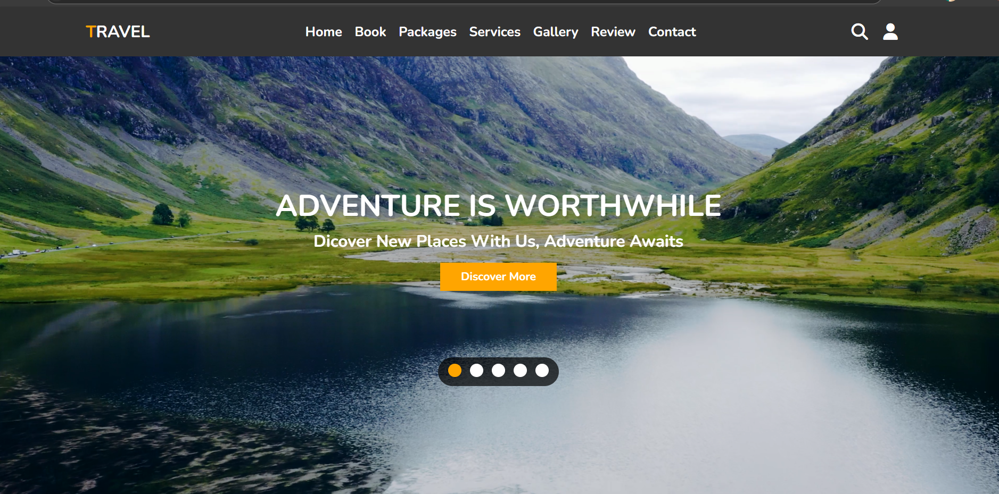

# 🌍 Responsive Tour & Travel Agency Website

A fully responsive and modern Tour & Travel Agency website built using **HTML**, **CSS**, and **JavaScript**. This project showcases a clean layout, interactive elements, and mobile-first design—ideal for travel agencies, tour planners, or portfolio display.



---

## ✨ Features

- ✅ Responsive Design (Mobile / Tablet / Desktop)
- 🎯 Smooth Scrolling and Animations
- 📸 Interactive Image Gallery
- 🧾 Customer Reviews Slider (Swiper.js)
- 📞 Contact Form UI
- 📍 Services Section (Tour Packages, Hotels, Destinations)
- 🗺️ Hero Section with Call-to-Action
- 💬 Clean Code Structure (HTML5/CSS3/Vanilla JS)

---

## 📁 Folder Structure

review-slider/

├── images/ # Contains review images (g-1.jpg, g-2.jpg, etc.)

├── index.html # Main HTML file

├── style.css # Styling for the website

├── script.js # Swiper initialization and configuration


---

## 🚀 Live Demo

You can check out the deployed project here:  
👉 https://harishna-k.github.io/TravelWebsite/
---

## 🛠️ Installation & Usage

1. **Clone the repository:**
   ```bash
   git clone https://github.com/Harishna-K/TravelWebsite.git
   cd TravelWebsite
   
2. Open index.html in your browser

   Or use Live Server in VS Code.


## 📦 Technologies Used

- HTML5

- CSS3 (Flexbox & Media Queries)

- JavaScript (Vanilla)

- Swiper.js for Review Slider


## 📢 Credits
- Icons: Font Awesome

- Fonts: Google Fonts

- Slider Library: Swiper.js


